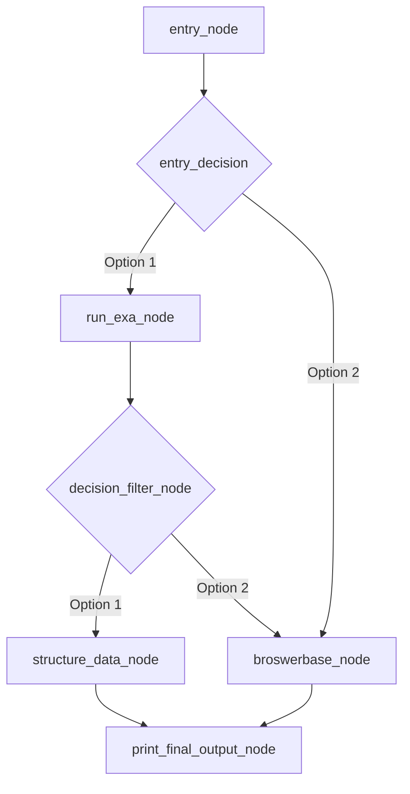

```mermaid
graph TD
    A[entry_node] --> B{entry_decision}
    B -->|Option 1| C[run_exa_node]
    B -->|Option 2| D[broswerbase_node]
    C --> E{decision_filter_node}
    E -->|Option 1| F[structure_data_node]
    E -->|Option 2| D
    F --> G[print_final_output_node]
    D --> G
```